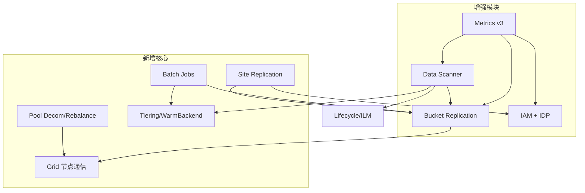

按模块整理的代码级 diff 如下。基线：本项目 = `RELEASE.2021-04-22`（Apache 2.0），new-minio = 上游最新社区版（AGPL v3）。

---

## 总览：代码规模变化

| 模块 | 代表文件 | 本项目行数 | new-minio行数 | 变化 |
|------|----------|-----------|--------------|------|
| 存储核心 | `xl-storage.go` | 2208 | 3423 | +55% |
| 元数据格式 | `xl-storage-format-v2.go` | 1319 | 2268 | +72% |
| Erasure Pool | `erasure-server-pool.go` | 1847 | 3005 | +63% |
| Erasure Object | `erasure-object.go` | 1303 | 2599 | +99% |
| 桶复制 | `bucket-replication.go` | 1094 | 3803 | +248% |
| 站点复制 | `site-replication.go` | — | 6284 | 全新 |
| IAM 核心 | `iam.go` | 2270 | 2556 | +13% |
| IAM 存储 | `iam-store.go` | — | 3072 | 全新拆分 |
| 管理 API | `admin-handlers.go` | 1858 | 3566 | +92% |
| 指标 v2 | `metrics-v2.go` | 1674 | 4435 | +165% |
| 指标 v3 | `metrics-v3.go` | — | 487+20文件 | 全新 |

---

## 1. 存储引擎

### 1.1 部署模式：大幅收窄

**本项目支持三种后端：**

```30:31:/Volumes/drive/dev/minio/main.go
	// Import gateway
	_ "github.com/minio/minio/cmd/gateway"
```

- **Erasure 分布式**（`erasure-*.go`）
- **FS 单机模式**（`fs-v1.go` 等 16 个文件，约 3000 行）
- **Gateway 模式**（`cmd/gateway/`：Azure/GCS/HDFS/NAS/S3）
- **Disk Cache**（`disk-cache*.go` 等 12 个文件）

**new-minio 全部移除**，只剩 Erasure 分布式。`main.go` 不再 import gateway。

### 1.2 xlMetaV2 元数据格式演进

`xl-storage-format-v2.go` 从 1319 行增至 2268 行，主要新增：

| 能力 | 本项目 | new-minio |
|------|--------|-----------|
| FreeVersion 标记 | 无 | `xlFlagFreeVersion` 标志位 |
| VersionHeader 结构 | 无独立 header | `xlMetaV2VersionHeader` 带 EC 信息 |
| 版本排序/匹配 | 简单 | `sortsBefore()`、`matchesNotStrict()` |
| Inline 小对象 | 有基础 inline | 增强，配合 scanner 统计 |
| Legacy 格式 | 有 | 保留 `xl-storage-format-v2-legacy.go` |

### 1.3 xl-storage 磁盘层

`xl-storage.go` +1215 行，主要变化：

- 更强的 **bitrot 检测/healing** 集成
- **Free Version** 对象管理（`xl-storage-free-version.go`，new-minio 独有）
- **Meta Inline** 优化（`xl-storage-meta-inline.go`）
- 去掉 `fallocate` 相关平台适配（本项目有 `fallocate_linux.go`）
- OS 层抽象统一：`os_unix.go` / `os_windows.go` 替代分散的 `os-readdir_*`

### 1.4 Erasure Server Pool：从「多 Set」到「可运维 Pool」

本项目 `erasure-server-pool.go`（1847 行）主要是多 pool 路由；new-minio（3005 行）新增完整 pool 生命周期：

```39:48:/Volumes/drive/dev/minio/new-minio/cmd/admin-handlers-pools.go
func (a adminAPIHandlers) StartDecommission(w http.ResponseWriter, r *http.Request) {
// ...
func (a adminAPIHandlers) CancelDecommission(w http.ResponseWriter, r *http.Request) {
// ...
func (a adminAPIHandlers) RebalanceStart(w http.ResponseWriter, r *http.Request) {
```

新增文件：
- `erasure-server-pool-decom.go` — Pool 下线（逐 bucket 迁移数据）
- `erasure-server-pool-rebalance.go` — Pool 间再均衡
- `poolMeta` 状态持久化，支持暂停/恢复/取消

### 1.5 Erasure Object：条件写 + 大对象路径重构

`erasure-object.go` 近乎翻倍（1303 → 2599 行）：

- **S3 条件写**（`If-Match` / `If-None-Match`），本项目无此逻辑
- `erasure-object-conditional_test.go`、`erasure-multipart-conditional_test.go` 新增测试
- Multipart 处理增强（968 → 1528 行）

### 1.6 节点间通信：Grid 替代 REST

new-minio 新增 `internal/grid/` + `cmd/grid.go`：

```31:46:/Volumes/drive/dev/minio/new-minio/cmd/grid.go
// globalGrid is the global grid manager.
var globalGrid atomic.Pointer[grid.Manager]
// ...
func initGlobalGrid(ctx context.Context, eps EndpointServerPools) error {
	hosts, local := eps.GridHosts()
	// ...
	g, err := grid.NewManager(ctx, grid.ManagerOptions{
		Dialer: grid.ConnectWS(
```

- 节点间用 **WebSocket 长连接 + mux**，替代大量短 REST 调用
- 独立 `globalLockGrid` 用于分布式锁
- 本项目 `cmd/rest/` 仍为主要节点通信方式

### 1.7 Data Scanner：从「生命周期执行器」到「统一治理引擎」

| 维度 | 本项目 | new-minio |
|------|--------|-----------|
| 行数 | 1277 | 1498 |
| 扫描入参 | `basePath string` | `disks []StorageAPI, drive *xlStorage`（直连磁盘） |
| 生命周期 | `applyLifecycle()` 简单 action | `applyActions()` 统一处理 ILM/复制/过渡 |
| 过渡/分层 | `applyTransitionAction()` | `applyTransitionRule()` + tier 后端联动 |
| 版本告警 | 无 | `alertExcessiveVersions()` |
| Bitrot 扫描 | 无 cycle 模式 | `getCycleScanMode()` 按周期切换 |
| 复制统计 | 无 | `replTargetSizeSummary` per-target 统计 |

---

## 2. IAM / 身份认证

### 2.1 架构重构：单体 → 三层分离

**本项目**：IAM 逻辑集中在 `iam.go`（2270 行），内嵌 `IAMStorageAPI` 接口、`UserIdentity`、`GroupInfo` 等数据结构。

**new-minio**：拆为三层：

| 文件 | 行数 | 职责 |
|------|------|------|
| `iam.go` | 2556 | 业务逻辑（策略/用户/组管理） |
| `iam-store.go` | 3072 | 存储抽象 + `iamCache` 内存缓存 |
| `iam-object-store.go` | 913 | 对象存储后端（含 cache 层） |
| `iam-etcd-store.go` | 502 | Etcd 后端（从 667 行精简） |

### 2.2 关键 API 变化

```go
// 本项目
func (sys *IAMSys) Load(ctx context.Context, store IAMStorageAPI) error
func (sys *IAMSys) Init(ctx context.Context, objAPI ObjectLayer)
func (sys *IAMSys) DeletePolicy(policyName string) error
func (sys *IAMSys) ListPolicies() (map[string]iampolicy.Policy, error)

// new-minio
func (sys *IAMSys) Load(ctx context.Context, firstTime bool) error
func (sys *IAMSys) Init(ctx context.Context, objAPI, etcdClient, iamRefreshInterval)
func (sys *IAMSys) DeletePolicy(ctx context.Context, policyName, notifyPeers) error
func (sys *IAMSys) ListPolicies(ctx context.Context, bucketName) (map[string]policy.Policy, error)
```

主要差异：
- 所有方法加 `context.Context`
- 支持 `notifyPeers` 集群同步
- 新增 `periodicRoutines()` 定期刷新
- 新增 `loadWatchedEvent()` Etcd watch 事件驱动更新
- 新增 `HasWatcher()` / `HasRolePolicy()` / `GetRolePolicy()`

### 2.3 IDP（身份提供商）大幅增强

**本项目**：LDAP 通过 `globalLDAPConfig` + `EnableLDAPSys()` 简单集成。

**new-minio** 新增独立 handler 文件：

| 文件 | 功能 |
|------|------|
| `admin-handlers-idp-ldap.go` | LDAP 用户/组/策略实体查询 |
| `admin-handlers-idp-openid.go` | OpenID 角色/AccessKey 批量管理 |
| `admin-handlers-idp-config.go` | IDP 配置管理 |

`IAMSys` 结构体新增：

```go
LDAPConfig   xldap.Config   // LDAP 用户系统
OpenIDConfig openid.Config  // OpenID 角色映射
rolesMap     map[string]string  // OpenID 角色 → 策略映射
```

新增方法：`ListLDAPUsers()`、`QueryLDAPPolicyEntities()`、`QueryPolicyEntities()`、`RevokeTokens()`

### 2.4 策略引擎外置

- 本项目：`pkg/iam/policy/`（15 个文件，内嵌仓库）
- new-minio：`github.com/minio/pkg/v3/policy`（外部包 v3.1.3）

桶策略（bucket policy）从 `pkg/bucket/policy/` 也外置到同一包。

### 2.5 STS 增强

`sts-handlers.go`：559 → 1120 行（翻倍），支持更多 token 类型和撤销机制。

`admin-handlers-users.go`：1291 → 3000 行，新增 Service Account 批量操作、用户状态管理、策略实体查询等。

---

## 3. 复制（Replication）

### 3.1 桶级复制：决策模型重写

`bucket-replication.go` 从 1094 行暴增至 3803 行，核心重构：

**决策返回值变化：**

```go
// 本项目
func mustReplicate(...) (replicate bool, sync bool)
func checkReplicateDelete(...) (replicate, sync bool)

// new-minio
func mustReplicate(...) (dsc ReplicateDecision)  // 结构化决策
func checkReplicateDelete(...) (dsc ReplicateDecision)
```

新增 `mustReplicateOptions` 结构体，区分：
- `isExistingObjectReplication()` — 已有对象复制
- `isMetadataReplication()` — 仅元数据复制
- `ReplicationStatus()` — 状态感知

### 3.2 MRF（Most Recent Failures）队列增强

本项目有基础 `AddMRFWorker()`；new-minio 大幅扩展：
- `MRFReplicateEntry` 结构化失败记录
- `queueMRFSave()` / `activeMRFWorkers` 独立 worker 池
- `ReplicateMRF` 审计事件类型
- `ReplicationWorkerOperation` 接口抽象

### 3.3 复制 Worker 池重构

```go
// 本项目
func NewReplicationPool(ctx, o, sz int) *ReplicationPool

// new-minio
func NewReplicationPool(ctx, o, opts replicationPoolOpts, stats *ReplicationStats)
```

新增 `replicateObjectWithMultipart()` 独立多段复制路径。

### 3.4 站点复制（Site Replication）：全新 6284 行

本项目完全没有。new-minio `site-replication.go` 实现跨站点全量同步：

| 同步范围 | 说明 |
|----------|------|
| Bucket 元数据 | 创建/删除/配置 |
| IAM 策略/用户/组 | 含 LDAP 用户、Service Account |
| IDP 配置 | LDAP/OpenID 设置必须一致 |
| Bucket 配置 | 加密/生命周期/复制/版本控制 |
| 对象数据 | 通过 bucket replication 联动 |

关键约束（代码级）：

```go
// 只有一个集群可以有数据
if localHasBuckets && nonLocalPeerWithBuckets != "" {
    return errSRInvalidRequest("only one cluster may have data")
}
// IAM/IDP 设置必须匹配
errSRIAMConfigMismatch(peer1, peer2, s1, s2 madmin.IDPSettings)
```

### 3.5 Batch 复制作业

新增 `batch-replicate.go` 等，支持通过 YAML 定义大规模复制任务（与 `batch-handlers.go` 统一管理）。

### 3.6 复制指标

新增：
- `bucket-replication-metrics.go`
- `bucket-replication-utils.go`
- `metrics-v3-bucket-replication.go`
- `metrics-v3-replication.go`
- `site-replication-metrics.go`

---

## 4. 监控与运维

### 4.1 Metrics 体系：v1 → v2 → v3 三代并存

| 版本 | 本项目 | new-minio |
|------|--------|-----------|
| v1 (`metrics.go`) | 761 行 | 573 行（精简） |
| v2 (`metrics-v2.go`) | 1674 行 | 4435 行（+165%） |
| v3 | 无 | 全新 20+ 文件 |

**Metrics v3** 按路径分发 collector：

```36:63:/Volumes/drive/dev/minio/new-minio/cmd/metrics-v3.go
const (
	apiRequestsCollectorPath         = "/api/requests"
	bucketAPICollectorPath           = "/bucket/api"
	bucketReplicationCollectorPath   = "/bucket/replication"
	systemDriveCollectorPath         = "/system/drive"
	clusterHealthCollectorPath       = "/cluster/health"
	clusterErasureSetCollectorPath   = "/cluster/erasure-set"
	clusterIAMCollectorPath          = "/cluster/iam"
	ilmCollectorPath                 = "/ilm"
	scannerCollectorPath             = "/scanner"
	// ...
)
```

新增监控维度：ILM 执行、Scanner 进度、审计日志、Logger Webhook、集群 IAM 状态、Erasure Set 健康。

### 4.2 实时与资源指标

新增：
- `metrics-realtime.go` — 实时请求速率
- `metrics-resource.go` — 资源使用追踪

### 4.3 HealthInfo 移除

本项目有 `healthinfo.go`（+ linux/nonlinux 平台文件），提供 `/minio/admin/v3/healthinfo` 端点；new-minio **完全删除**，功能被 metrics-v3 `/cluster/health` 替代。

### 4.4 Speedtest

new-minio 新增 `speedtest.go`，提供集群网络/磁盘性能测试 API。

### 4.5 Callhome

new-minio 新增 `callhome.go`，可选遥测上报（`internal/config/callhome`）。

---

## 5. 生命周期与分层（ILM / Tiering）

### 5.1 生命周期

`bucket-lifecycle.go`：711 → 1126 行

| 变化 | 说明 |
|------|------|
| 审计 | 新增 `bucket-lifecycle-audit.go` |
| ILM 配置 | 新增 `ilm-config.go` 集中管理 |
| Scanner 集成 | `evalActionFromLifecycle()` 返回 `lifecycle.Event` 而非简单 `Action` |
| 过渡执行 | 与 Tier 后端联动（见下） |

### 5.2 分层（Tiering）：全新模块

本项目完全没有。new-minio 新增完整分层栈：

| 文件 | 功能 |
|------|------|
| `tier.go` (594行) | `TierConfigMgr` 配置管理 |
| `tier-handlers.go` | S3 Admin API |
| `tier-sweeper.go` | 过期分层对象清理 |
| `tier-last-day-stats.go` | 分层统计 |
| `warm-backend.go` | 抽象接口 |
| `warm-backend-s3.go` | S3 远端 |
| `warm-backend-gcs.go` | GCS 远端 |
| `warm-backend-azure.go` | Azure 远端 |
| `warm-backend-minio.go` | MinIO 远端 |

Data Scanner 在扫描时自动触发 `applyTransitionRule()` → 调用 `WarmBackend` 迁移冷数据。

### 5.3 Batch 作业系统

`batch-handlers.go`（2356 行）统一管理：

| 作业类型 | 文件 |
|----------|------|
| 批量过期 | `batch-expire.go` |
| 批量复制 | `batch-replicate.go` |
| 批量轮转 | `batch-rotate.go` |

通过 YAML 定义、Admin API 提交、后台 worker 执行。

---

## 6. 加密 / KMS

### 6.1 代码迁移

| 本项目 | new-minio |
|--------|-----------|
| `cmd/crypto/`（25 文件） | `internal/crypto/`（14 文件） |
| `pkg/kms/`（5 文件） | `internal/kms/`（11 文件） |

### 6.2 新增能力

- `kms-handlers.go`（328 行）+ `kms-router.go` — 独立 KMS Admin API
- `internal/crypto/auto-encryption.go` — 自动加密
- `internal/kms/kes.go` + `secret-key.go` — KES 集成增强
- Vault 支持从 `cmd/crypto/vault.go` 移除（可能外置到 KES）

### 6.3 bucket-encryption

基本保持（60 → 53 行），逻辑迁入 internal 包。

---

## 7. 通知系统（Event / Notification）

### 7.1 规模

`notification.go`：1556 → 1632 行（小幅增长）

### 7.2 Event Target

| Target | 本项目 | new-minio |
|--------|--------|-----------|
| AMQP | ✅ | ✅ |
| Elasticsearch | ✅ | ✅ |
| Kafka | ✅ | ✅ |
| MQTT | ✅ | ✅ |
| MySQL | ✅ | ✅ |
| NATS | ✅ | ✅ |
| NSQ | ✅ | ✅ |
| PostgreSQL | ✅ | ✅ |
| Redis | ✅ | ✅ |
| Webhook | ✅ | ✅ |
| QueueStore | ✅ (`queuestore.go`) | ❌ 移除 |
| Store | ✅ (`store.go`) | ❌ 移除 |

通知目标基本保留，但队列持久化层（`queuestore`/`store`）被简化。

### 7.3 新增

- `event-notification.go`（new-minio 独有）— 事件通知解耦
- `metrics-v3` 中 `/notification` collector

---

## 8. 管理 API（Admin）

`admin-handlers.go`：1858 → 3566 行（+92%）

### 新增 Admin 能力汇总

| 类别 | 新增 Handler |
|------|-------------|
| Pool 运维 | `admin-handlers-pools.go` — 下线/再均衡/状态 |
| 站点复制 | `admin-handlers-site-replication.go` |
| IDP 管理 | `admin-handlers-idp-{ldap,openid,config}.go` |
| 用户管理 | `admin-handlers-users.go` 大幅扩展 |
| Batch 作业 | 通过 `batch-handlers.go` |
| KMS | `kms-handlers.go` |
| Tier | `tier-handlers.go` |
| Rebalance | `rebalance-admin.go` |

### 移除

- `HealthInfoHandler` — 整个 healthinfo 模块删除
- Web UI handlers（`web-handlers.go`、`web-router.go`）

---

## 9. S3 API / 新增协议

| 能力 | 本项目 | new-minio |
|------|--------|-----------|
| Object Handlers | 4007 行 | 3585 行（精简但能力更多） |
| Bucket Handlers | 1664 行 | 2035 行 |
| Object Lambda | ❌ | `object-lambda-handlers.go` (227行) |
| SFTP 服务 | ❌ | `sftp-server.go` (523行) |
| FTP 服务 | ❌ | `ftp-server.go` (171行) |
| S3 Zip | ❌ | `s3-zip-handlers.go` |
| Post Policy Fan-out | ❌ | `post-policy-fan-out.go` |
| Peer S3 | ❌ | `peer-s3-client.go` / `peer-s3-server.go` |
| Veeam SOS API | ❌ | `veeam-sos-api.go` |

---

## 10. 配置系统

### 目录迁移

```
本项目: cmd/config/          →  new-minio: internal/config/
本项目: pkg/bucket/          →  new-minio: internal/bucket/
本项目: pkg/iam/policy/       →  github.com/minio/pkg/v3/policy
本项目: pkg/madmin/          →  github.com/minio/madmin-go/v3
```

### 配置项变化

| 配置 | 本项目 | new-minio |
|------|--------|-----------|
| `cache`（磁盘缓存） | ✅ `cmd/config/cache/` | ❌ 移除 |
| `ilm` | ❌ | ✅ `internal/config/ilm/` |
| `lambda` | ❌ | ✅ `internal/config/lambda/` |
| `batch` | ❌ | ✅ `internal/config/batch/` |
| `callhome` | ❌ | ✅ `internal/config/callhome/` |
| `scanner` | ❌ | ✅ `internal/config/scanner/` |
| `drive` | ❌ | ✅ `internal/config/drive/` |
| `subnet` | ❌ | ✅ `internal/config/subnet/` |
| `browser` | ❌ | ✅ 配置项保留但 UI 已移除 |

---

## 11. 依赖与技术栈

| 维度 | 本项目 | new-minio |
|------|--------|-----------|
| Go | 1.16 | 1.24 |
| JWT | `dgrijalva/jwt-go`（已废弃） | `golang-jwt/jwt/v4` |
| Admin SDK | 内嵌 `pkg/madmin/` | `madmin-go/v3` v3.0.109 |
| 公共库 | 内嵌 `pkg/` | `minio/pkg/v3` v3.1.3 |
| 并发 | `sync` + `errgroup` | `xsync/v3` + `singleflight` |
| 序列化 | `encoding/json` | `json-iterator` |
| Etcd | 旧 client | `go.etcd.io/etcd/client/v3` |
| Azure | 旧 SDK | `azure-sdk-for-go/sdk` |
| Parquet | 内嵌 copy | `fraugster/parquet-go` |

---

## 模块间依赖关系（new-minio 新增）



---

## 迁移建议（按模块）

| 模块 | 能否直接移植 | 难度 | 说明 |
|------|-------------|------|------|
| 存储引擎 | ❌ | 极高 | 元数据格式不兼容，需迁移工具 |
| IAM | 部分 | 高 | 存储路径兼容，但 API 签名全变 |
| 桶复制 | 部分 | 中 | 配置格式兼容，决策逻辑需适配 |
| 站点复制 | ✅ 新增 | 低 | 全新功能，可直接启用 |
| 监控 | ✅ 新增 | 低 | v3 独立端点，不影响现有 |
| 分层/Tier | ✅ 新增 | 低 | 需配置远端后端 |
| Gateway/FS | ❌ 不可移植 | — | new-minio 已删除，无法回迁 |
| Disk Cache | ❌ 不可移植 | — | 已删除 |

如果你打算从本项目向 new-minio 迁移，最需要优先评估的是 **xlMetaV2 格式兼容性** 和 **AGPL 合规**；如果只想摘取某个模块（比如 Site Replication 或 Metrics v3），可以指定模块，我可以进一步做函数级 diff 和移植可行性分析。